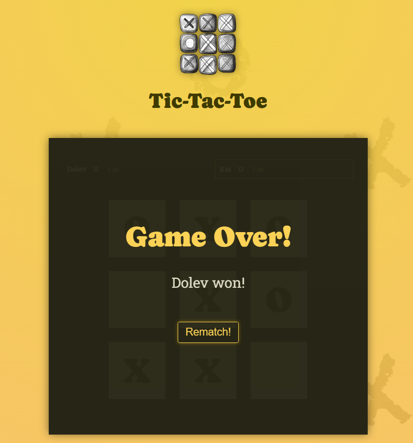
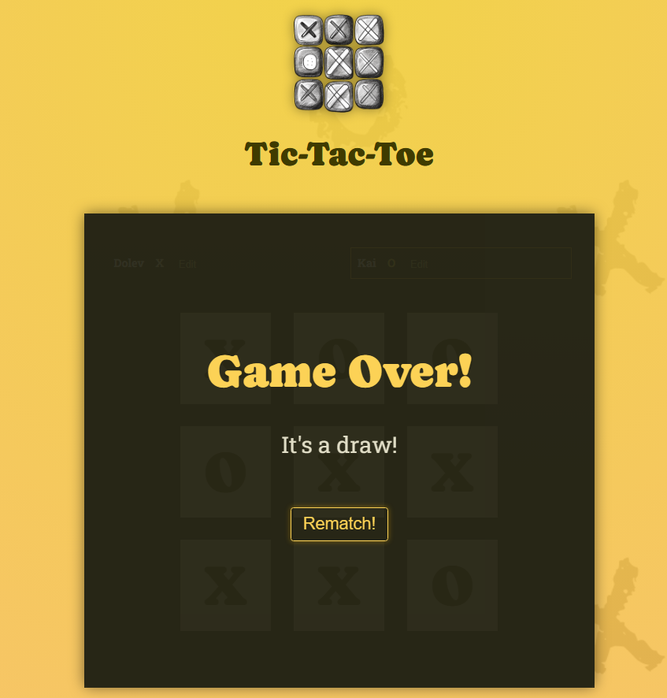

# React Tic Tac Toe Game

This is a simple Tic Tac Toe game built using React. It allows two players to play against each other on a 3x3 grid.

## Features

- Two players can play against each other.
- Alternating turns between "X" and "O".
- Indicates the winner when a player wins.
- Displays a draw message when the game ends in a draw.
- Option to restart the game after completion.

## Technologies Used

- React
- JavaScript (ES6+)
- HTML5
- CSS3

## How to Play

1. Clone the repository to your local machine using `git clone`.
2. Navigate into the project directory.
3. Install dependencies using `npm install`.
4. Start the development server using `npm run dev`.
5. Open your web browser and visit `http://localhost:5173`.
6. Start playing the Tic Tac Toe game by clicking on the squares to place your "X" or "O" marker.
7. Alternate turns with your opponent until a player wins or the game ends in a draw.
8. To restart the game, click on the "Rematch!" button.

## Screenshots

## Contributing

Contributions are welcome! If you'd like to contribute to this project, please follow these steps:

1. Fork the repository.
2. Create your feature branch (`git checkout -b feature/YourFe
